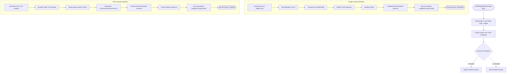

[中文文档](./docs/README_zh.md) | [English](./README.md)

# scRNAseqMulticommand

*   **Author**: Zhang Jian
*   **Date**: 2025-12-23
*   **Version**: v4.1.0-alpha

## Introduction

### `scRNAseqMulticommand`
`scRNAseqMulticommand` is an automated scRNA-seq data analysis pipeline built upon mainstream software such as `Seurat` and `SingleR`. It supports both `10x Genomics` and `MGI DNBC4` platforms.


Starting from the gene expression matrix, the pipeline automatically performs the following steps:
1.  **Quality Control**: Performs initial filtering, Doublet detection, and Ambient RNA contamination assessment.
2.  **Dimensionality Reduction & Clustering**: Conducts standardized PCA dimensionality reduction and clustering analysis.
3.  **Auto-Annotation**: Automatically selects the best Reference & Markers based on the provided species and tissue information. It employs `SingleR`, `CellID`, and `ScType` strategies for precise cluster annotation.
4.  **Visualization**: Generates a wide range of visualization plots, including dimensionality reduction maps, heatmaps, dot plots, and more.
5.  **Multi-Sample Integration**: Intelligently determines the analysis mode. For multi-sample data, it defaults to Seurat's CCA method but also supports `Harmony` or a combination of multiple integration methods.
6.  **Cross-Platform Support**: Powered by `zellkonverter`, it enables seamless conversion between Seurat (R) and AnnData (Python) formats, allowing users to switch flexibly between R and Python environments.

### Key Updates (v4.1.1)
1.  **Per-Sample Library Type Support**: Added support for mixed library types in a single analysis run. Now you can specify `library_type` for each sample in the configuration file, allowing simultaneous processing of both 10x Genomics and MGI DNBC4 data.
2.  **Removed Global Library Type Parameter**: The `-T/--scRNAtype` command-line parameter has been removed. Library type must now be specified **per sample** in the `scRNA-seq.conf` configuration file via the `library_type` column.
3.  **Mandatory Library Type Validation**: The pipeline now strictly validates that the input configuration file contains the `library_type` column and that all values are either `10x` or `DNBC4`. Missing or invalid values will cause an immediate error.
4.  **Adaptive MAD QC**: Introduced a robust, data-driven Quality Control strategy using Median Absolute Deviation (MAD) to automatically determine filtering thresholds for each sample, replacing rigid fixed cutoffs.
5.  **Core Refactoring**: The `src/core/` module has been completely refactored to optimize underlying logic, significantly enhancing execution stability and maintainability.
6.  **Dynamic Memory Management**: Automatically detects available system memory (via `/proc/meminfo`) and allocates **80% of total RAM** to `future.globals.maxSize`. This ensures stability when processing large datasets (100k+ cells) in memory-constrained Docker environments.
7.  **Serialization**: Uses `qs` for high-performance object serialization with S4 object support.
8.  **Multi-Species & Chinese Support**: Full support for plant species analysis (e.g., *Arabidopsis thaliana*, TaxID: 3702) and seamless compatibility with datasets containing Chinese labels.
9.  **Containerization**: Fully functional Docker support with multi-stage builds for optimized image size.

### Pipeline Workflow

Below is the high-level workflow of the `scRNAseqMulticommand` pipeline:



### Analysis Logic Overview

1.  **Modular Design**: The pipeline is divided into `init` (setup), `cli` (parameter handling), `core` (analysis logic), and `viz` (visualization) modules.
2.  **Adaptive Branching**: Automatically detects single vs. multi-sample mode.
3.  **Advanced QC**: Includes Doublet detection (`DoubletFinder`) and Ambient RNA estimation (`DecontX`) to ensure high-quality data.
4.  **Flexible Integration**: Supports multiple batch-correction methods including CCA, Harmony, RPCA, and SCVI (via `scvi-tools`).
5.  **Comprehensive Annotation**: Combines `SingleR` (reference-based), `ScType` (marker-based), and `CellID` (gene set enrichment) for robust cell type identification.
6.  **High Performance**: Utilizes `qs` for fast data serialization and supports multi-threading for intensive tasks.

## Software Requirements

### Environment Installation (Recommended)
It is highly recommended to use **micromamba** (or conda/mamba) to build the analysis environment using the provided YAML configuration file. This ensures consistency across dependency versions.

```bash
# 1. Create the environment using the configuration file
micromamba create -f build_analysis_env/scRNAseqMulticommand_environment.yml

# 2. Activate the environment before running the pipeline
micromamba activate scRNAseq_analysis
```

### Manual R Packages Installation (Alternative)
If manual configuration is required, please ensure the following R packages are installed:

```R
# Basic Utilities
install.packages(c("yaml", "log4r", "getopt", "stringr", "crayon", "praise", "dplyr", "progress", "HGNChelper", "pander", "tidyverse", "tools", "data.table", "sommer", "lubridate"))

# Homologene Gene Conversion
install.packages("homologene")

# scRNA-seq Analysis Core
install.packages(c("Seurat", "scater", "uwot", "zellkonverter"))

# Quality Control
install.packages("decontX") # from celda
install.packages("DoubletFinder")

# Visualization
install.packages(c("scCustomize", "patchwork", "ggplot2", "ggpubr", "ggrepel", "clustree", "gtools", "cowplot", "viridis"))

# Auto-annotation
install.packages(c("celldex", "SingleR"))

# Parallel Computing
install.packages(c("parallel", "BiocParallel"))
```

### Required Reference Data
To leverage the auto-annotation features, please prepare the following database files:

```bash
# CellMarker 2.0 Database
  Cell_marker_Human.txt
  Cell_marker_Mouse.txt

# PanglaoDB Database
  PanglaoDB_markers_27_Mar_2020.tsv

# ScType Database
  ScTypeDB_full.xlsx

# SingleR References (Human)
  HumanBlueprintEncode.rds
  HumanNovershternHematopoietic.rds
  HumanDICEImmuneCell.rds
  HumanPrimaryCellAtla.rds          
  HumanMonacoImmune.rds

# SingleR References (Mouse)
  MouseImmGen.rds
  MouseRNA.rds
```

### Roadmap

**Phase 1: Algorithm Enhancements**
1.  **Adaptive QC Strategy**: **(Done)** Implemented MAD-based adaptive filtering for robust QC.
2.  **Advanced Integration**: **(Done)** Added RPCA and SCVI support.

**Phase 2: Engineering & Efficiency**
1.  **Checkpointing System**: Introduce a smart **resume capability**. The pipeline will automatically save intermediate RDS objects (e.g., after QC, Integration) and skip completed steps upon restart.
2.  **Parallelization Optimization**: Refine multi-threading strategies, particularly for `FindMarkers` and `DoubletFinder`, to maximize CPU usage while preventing memory overflows (OOM).

**Phase 3: Architecture & Visualization**
1.  **Big Data Support**: Explore **BPCells** or on-disk processing integration to handle atlas-level datasets (100k+ cells) with limited RAM.
2.  **Interactive HTML Reports**: Generate self-contained HTML reports (via `Quarto` or `ShinyCell`) allowing users to interactively explore UMAP clusters and gene expression without coding.
3.  **Full-Stack Pipeline**: Integrate with `UniverSC-seq` upstream tools to achieve a raw-data-to-report workflow.

**Phase 4: Ecosystem & Serialization**
1.  **Serialization**: Uses `qs` package which supports S4 objects (like Seurat) with reliable serialization.
2.  **Dependency Modernization**: Review and update the core environment (YAML) to align with the latest Bioconductor and CRAN standards.

**Phase 5: Agent-Centric Evolution (v5.0 - Planned)**
1.  **Structured Metadata Feedback**: Automatically generate `analysis_summary.json` at each stage (QC, Integration, Annotation) to provide the AI Agent with machine-readable insights (e.g., cell retention rates, quality alerts).
2.  **Atomic Execution & Checkpointing**: Implement `--step [name]` and `--resume` modes, allowing the Agent to execute specific analysis modules or retry steps with adjusted parameters without re-running the entire pipeline.
3.  **Deep Python Interoperability**: Enhance H5AD export to ensure 1:1 compatibility with AnnData 4.0, preserving Seurat v5 layers and reductions for seamless downstream analysis in Python-based Agent environments.
4.  **Agent SDK (Python Wrapper)**: Develop a lightweight Python library to manage pipeline execution, parameter validation, and real-time log parsing for seamless integration into AI Agent frameworks.

## Usage

> **NOTE**: Before execution, ensure the Rscript interpreter path in the script points to your mamba environment. If you are using Docker, no modification is necessary.

### Command Example

```bash
scRNAseqMulticommand \
  -c scRNA-seq.conf \
  -o ./ \
  -I 3702 \
  -F Cellmarker \
  -O Leaf \
  -n plant_v8
```

### Parameters

| Short | Long | Description | Example/Default |
| :--- | :--- | :--- | :--- |
| `-c` | `--scRNAseqdataframe` | **Required**. Path to the sample configuration file (.csv) | `scRNA-seq.conf` |
| `-o` | `--outputdir` | **Required**. Results output directory | `./output` |
| `-n` | `--projectname` | **Required**. Project Name/ID | `plant_v8` |
| `-I` | `--origintaxID` | **Required**. Species Taxonomy ID | `9606`(Human), `10090`(Mouse), `3702`(Arabidopsis) |
| `-F` | `--scRNAref` | **Required**. Marker Database | `Cellmarker`, `PanglaoDB` |
| `-O` | `--organ` | **Required**. Target Organ/Tissue | `Blood`, `Leaf`, `Stomach` |
| `-A` | `--AnnReference` | [Optional] SingleR Reference Name | `HumanPrimaryCellAtla` |
| `-i` | `--intergetmethods` | [Optional] Multi-sample integration method | `CCA` (Default), `Harmony`, `ALL` |
| `-r` | `--reduceType` | [Optional] Whether to use tSNE | `FALSE` (Default) |
| `-a` | `--autofiltedcell` | [Optional] Whether to auto-filter cells | `TRUE` (Default) |

### Input File Format (scRNA-seq.conf)
The configuration file (`-c` parameter) must be in CSV/TSV format, and the header must include `CellRanger,name,group,library_type`.

*   **CellRanger**: Path to the CellRanger output directory (containing `matrix.mtx.gz`) or the specific matrix folder.
*   **name**: Unique sample ID.
*   **group**: Experimental group info (used for differential analysis, etc.).
*   **library_type**: Library construction type for each sample (`10x` or `DNBC4`).

**Example Content (Mixed Library Types):**
```csv
CellRanger,name,group,library_type
/path/to/sample1/outs/filtered_feature_bc_matrix,Sample1,Control,10x
/path/to/sample2/outs/filtered_feature_bc_matrix,Sample2,Treatment,DNBC4
/path/to/sample3/outs/filtered_feature_bc_matrix,Sample3,Treatment,10x
```

**Important Warning:** Different library preparation workflows (e.g., 10x Genomics vs. MGI DNBC4) or different versions of the same workflow may produce gene expression matrices with different sets of genes. This **will 100% cause errors** during the analysis pipeline when trying to integrate or compare samples with mismatched gene sets. Please ensure all samples are processed using the same library preparation workflow and reference genome version to avoid this issue.

## Output Structure
Analysis results are automatically organized into categorized directories.

### Multi-Sample Output Example
```bash
├── annotation
│   ├── auto-annotation-CellID      # CellID Annotation Results
│   ├── auto-annotation-sctype      # ScType Annotation Results
│   ├── auto-annotation-SinglR      # SingleR Annotation Results
│   ├── proportions-plot            # Cell Proportion Statistical Plots
│   └── tSNE-annotation-plot-plot   # tSNE/UMAP Annotation Visualizations
├── BatchCheck                      # Batch Effect Assessment Results
├── cluster
│   ├── DoHeatmap-plot              # Clustering Heatmaps
│   ├── DotPlot-plot                # Marker Gene Dot Plots
│   ├── marker_gene                 # Marker Gene Lists for each Cluster
│   ├── tSNE-plot                   # tSNE Plots
│   └── UMAP-plot                   # UMAP Plots
├── DealPatch                       # Intermediate Files from Integration
├── figure
│   ├── deg                         # Differential Expression Analysis (DEG) Results
│   │   └── marker_gene
│   └── subset_cell_cluster
├── output                          # Final Seurat Objects (RDS) and Key Data
└── QC
    ├── Cellranger-result           # Original Mapping Statistics
    ├── doublet                     # Doublet Detection Reports
    └── RNAContamination            # Ambient RNA Contamination Assessment
```

## Docker Support

We provide two Dockerfiles: a standard build and a multi-stage build for optimized image size.

### 1. Build the Image

**Option A: Standard Build (Simplest)**
```bash
docker build -t scrnaseqmulticommand:latest -f build_analysis_env/scRNAseqMulticommand.Dockerfile .
```

**Option B: Multi-Stage Build (Optimized Size)**
```bash
docker build -t scrnaseqmulticommand:latest -f build_analysis_env/multiStage.Dockerfile .
```

### 2. Run the Container

**Interactive Mode:**
Start an interactive shell with your current directory mounted to `/home/mambauser/workdir`.
```bash
docker run -it --rm \
  -v $(pwd):/home/mambauser/workdir \
  scrnaseqmulticommand:latest /bin/bash
```

**Direct Execution:**
Run the analysis pipeline directly on data in your current directory.
```bash
docker run --rm \
  -v $(pwd):/home/mambauser/workdir \
  scrnaseqmulticommand:latest \
  scRNAseqMulticommand -c scRNA-seq.conf -o ./output -n my_project -I 9606 -F Cellmarker -O Blood
```

## CI/CD & Testing

This project includes automated testing infrastructure for continuous integration.

### Local Testing

1. **Prepare test data:**
```bash
cd data/testdata

# Download 10x PBMC test data
wget https://cf.10xgenomics.com/samples/cell-exp/7.1.0/pbmc_1k_v3/pbmc_1k_v3_filtered_feature_bc_matrix.tar.gz
tar -xzf pbmc_1k_v3_filtered_feature_bc_matrix.tar.gz

# Create two sample directories
mkdir -p sample1/outs/filtered_feature_bc_matrix
mkdir -p sample2/outs/filtered_feature_bc_matrix

# Copy data to both samples
cp -r pbmc_1k_v3_filtered_feature_bc_matrix/* sample1/outs/filtered_feature_bc_matrix/
cp -r pbmc_1k_v3_filtered_feature_bc_matrix/* sample2/outs/filtered_feature_bc_matrix/

# Clean up
rm -rf pbmc_1k_v3_filtered_feature_bc_matrix pbmc_1k_v3_filtered_feature_bc_matrix.tar.gz
```

2. **Run test script:**
```bash
./data/run_test.sh
```

Or manually:
```bash
# Build image
docker build --no-cache \
  --tag scrna-seq-multicommand:v4.1.1-alpha \
  -f ./build_analysis_env/multiStage.Dockerfile ./

# Run test
docker run --rm \
  -v $(pwd)/data/testdata:/home/mambauser/workdir/data \
  -v $(pwd)/data/test_output:/home/mambauser/workdir/output \
  -v $(pwd)/Celldex:/home/mambauser/scRNAseqMulticommand/Celldex \
  scrna-seq-multicommand:v4.1.1-alpha \
  Rscript /home/mambauser/scRNAseqMulticommand/scRNAseqMulticommand \
  -c /home/mambauser/workdir/data/scRNA-seq.conf \
  -o /home/mambauser/workdir/output \
  -I 9606 \
  -F Cellmarker \
  -O Blood \
  -n test_run
```

### GitHub Actions (Auto CI)

The project includes `.github/workflows/docker-test.yml` which automatically:

1. **Triggers on:**
   - Push to `master` branch
   - Pull requests to `master`
   - Manual trigger (`workflow_dispatch`)

2. **Actions performed:**
   - Builds Docker image using multi-stage Dockerfile
   - Verifies R and Rscript are accessible
   - Checks key R packages (Seurat, qs, SingleR, Harmony, celda)

**View workflows:** Go to `https://github.com/<your-repo>/actions`

### Test Data Structure

```
data/
├── testdata/
│   ├── scRNA-seq.conf           # Sample configuration
│   ├── sample1/outs/filtered_feature_bc_matrix/
│   │   ├── features.tsv.gz
│   │   ├── matrix.mtx.gz
│   │   └── barcodes.tsv.gz
│   └── sample2/outs/filtered_feature_bc_matrix/
│       └── ... (same structure)
└── test_output/                  # Generated by test run
```

### Version Tagging

Build with specific version:
```bash
docker build --no-cache \
  --tag scrna-seq-multicommand:v4.1.1-alpha \
  -f ./build_analysis_env/multiStage.Dockerfile ./
```
