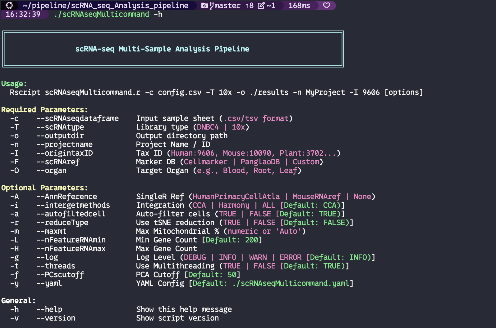
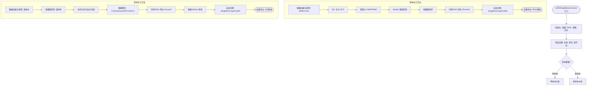

# scRNAseqMulticommand

*   **Author**: Zhang Jian
*   **Date**: 2025-12-23
*   **Version**: v4.1.0-alpha

## 简介 (Introduction)

### `scRNAseqMulticommand`
`scRNAseqMulticommand` 是基于 `Seurat` & `SingleR` 等主流软件搭建的 `10x` & `MGI DNBC4` scRNA-seq 数据自动分析流程。



该流程从基因表达矩阵开始，自动化执行以下步骤：
1.  **数据质控**：执行初步过滤、Doublet（双细胞）检测及环境 RNA 污染检测。支持自适应 MAD 过滤。
2.  **降维聚类**：完成标准化的 PCA 降维与聚类分析。
3.  **自动注释**：根据用户指定的物种与组织信息，自动选择最佳 Reference & Marker，结合 `SingleR`、`CellID` 和 `ScType` 三种策略对 Cluster 进行精准注释。
4.  **可视化**：生成丰富的可视化图表，包括降维图、热图、气泡图等。
5.  **多样本整合**：智能判断分析模式。支持 `CCA`、`Harmony`、`RPCA` 及 `SCVI` 等多种整合方法。
6.  **跨平台支持**：基于 `zellkonverter` 实现了 `Seurat` 与 `AnnData (Python)` 格式之间的无缝转换，便于用户在 `R` 与 `Python` 环境间灵活切换。

### 本次更新亮点 (v4.1.1)
1.  **逐样本文库类型支持**: 新增在单次分析运行中支持混合文库类型的功能。现在您可以在配置文件中为每个样本指定 `library_type`，允许同时处理 10x Genomics 和 MGI DNBC4 数据。
2.  **自适应 MAD 质控**: 引入基于正态离群值检测的 **MAD (Median Absolute Deviation)** 过滤策略，自动计算每个样本的最佳质控阈值，取代僵硬的固定阈值。
3.  **核心代码重构**: 对 `src/core/` 进行了全面重构，优化了底层逻辑，显著提升了运行稳定性与可维护性。
4.  **动态内存管理**: 自动探测系统可用内存（通过 `/proc/meminfo`），并将总 RAM 的 **80%** 分配给 `future.globals.maxSize`。这确保了在内存受限的 Docker 环境下处理大规模数据集（10万+细胞）时的稳定性。
5.  **序列化**: 使用 `qs` 包进行高性能对象序列化，支持 S4 对象（如 Seurat）。
6.  **多物种与中文支持**: 现已完整支持植物（如拟南芥，TaxID: 3702）分析，并完美兼容包含中文标签的单细胞数据。
7.  **容器化增强**: 优化了 Docker 构建流程，提供多阶段构建（Multi-stage build）以显著缩小镜像体积。

### 流程工作流 (Pipeline Workflow)

以下是 `scRNAseqMulticommand` 流程的高层级工作流展示：



### 分析逻辑概览 (Analysis Logic Overview)

1.  **模块化设计**: 流程分为 `init` (设置)、`cli` (参数处理)、`core` (分析逻辑) 和 `viz` (可视化) 模块。
2.  **自适应分支**: 自动检测单样本 vs 多样本模式。
3.  **高级质控**: 包含双细胞检测 (`DoubletFinder`) 和环境 RNA 评估 (`DecontX`)，确保高质量数据。
4.  **灵活整合**: 支持多种批次校正方法，包括 CCA、Harmony、RPCA 和 SCVI (通过 `scvi-tools`)。
5.  **全面注释**: 结合 `SingleR` (基于参考集)、`ScType` (基于 Marker) 和 `CellID` (基于基因集富集) 实现稳健的细胞类型识别。
6.  **高性能**: 利用 `qs` 进行快速数据序列化，并支持密集型任务的多线程并行。

## 软件依赖 (Software Requirements)

### 环境安装 (推荐)
强烈建议使用 **micromamba** (或 `conda/mamba`) 通过提供的 `YAML` 配置文件构建分析环境，以确保依赖版本的一致性。

```bash
# 1. 使用配置文件创建环境
micromamba create -f build_analysis_env/scRNAseqMulticommand_environment.yml

# 2. 运行流程前激活环境
micromamba activate scRNAseq_analysis
```

### 手动安装 R 包 (备选)
若需手动配置，请确保安装以下 R 包：

```R
# 基础工具
install.packages(c("yaml", "log4r", "getopt", "stringr", "crayon", "praise", "dplyr", "progress", "HGNChelper", "pander", "tidyverse", "tools", "data.table", "sommer", "lubridate"))

# 同源基因转换
install.packages("homologene")

# scRNA-seq 分析核心
install.packages(c("Seurat", "scater", "uwot", "zellkonverter"))

# 质控相关
install.packages("decontX") # from celda
install.packages("DoubletFinder")

# 可视化
install.packages(c("scCustomize", "patchwork", "ggplot2", "ggpubr", "ggrepel", "clustree", "gtools", "cowplot", "viridis"))

# 自动注释
install.packages(c("celldex", "SingleR"))

# 并行计算
install.packages(c("parallel", "BiocParallel"))
```

### 必需参考数据集 (Required Reference)
为了发挥自动注释功能，请准备以下数据库文件：

```bash
# CellMarker 2.0 数据库
  Cell_marker_Human.txt
  Cell_marker_Mouse.txt

# PanglaoDB 数据库
  PanglaoDB_markers_27_Mar_2020.tsv

# ScType 数据库
  ScTypeDB_full.xlsx

# SingleR 参考数据集 (Human)
  HumanBlueprintEncode.rds
  HumanNovershternHematopoietic.rds
  HumanDICEImmuneCell.rds
  HumanPrimaryCellAtla.rds          
  HumanMonacoImmune.rds

# SingleR 参考数据集 (Mouse)
  MouseImmGen.rds
  MouseRNA.rds
```

### 未来规划 (Roadmap)

**阶段 1: 算法增强**
1.  **自适应质控策略**: **(已完成)** 实现基于 MAD 的自动阈值过滤。
2.  **高级整合算法**: **(已完成)** 引入 RPCA 与 SCVI 支持。

**阶段 2: 工程与效率优化**
1.  **断点续传系统**: 引入智能 **Resume** 功能。流程将自动保存中间 RDS 对象，并在重启时自动跳过已完成的步骤。
2.  **并行化优化**: 精细化多线程策略，特别是针对 `FindMarkers` 和 `DoubletFinder`，在最大化 CPU 利用率的同时防止内存溢出 (OOM)。

**阶段 3: 架构与可视化升级**
1.  **大数据支持**: 探索 **BPCells** 或 On-disk 处理技术，以支持在有限内存下处理百万级细胞。
2.  **交互式 HTML 报告**: 自动生成交互式网页报告 (基于 `Quarto` 或 `ShinyCell`)，让用户无需代码即可探索聚类和基因表达。
3.  **全栈流水线整合**: 整合 `UniverSC-seq` 上游流程，实现从 `FastQ` 到 `Report` 的全链路分析。

**阶段 4: 生态系统与序列化**
1.  **序列化**: 使用 `qs` 包进行对象序列化，支持 S4 对象（如 Seurat）。
2.  **依赖现代化**: 审视并更新核心环境 (YAML)，使其符合最新的 Bioconductor 和 CRAN 标准。

**阶段 5: 面向 Agent 的工业级进化 (v5.0 - 计划中)**
1.  **结构化元数据反馈 (Structured Feedback)**: 在每个分析阶段（QC, 整合, 注释）自动生成 `analysis_summary.json`，为 AI Agent 提供可读的分析快照（如细胞留存率、质量预警等）。
2.  **原子化执行与断点续传 (Atomic Control)**: 实现 `--step [name]` 与 `--resume` 运行模式，允许 Agent 按需调用特定模块或在调整参数后仅重跑特定步骤，避免重头运行全流程。
3.  **深度 Python 互操作性 (H5AD Excellence)**: 深度优化 H5AD 导出功能，确保与 Python 生态（Scanpy/AnnData 4.0）100% 兼容，高保真还原 Seurat v5 的 Layers 和降维结果。
4.  **Agent SDK (Python 包装库)**: 开发配套的 Python 客户端库，简化 Agent 对分析流程的调用、参数校验以及实时日志解析。

## 使用方法 (Usage)

> **注意**: 运行前，请务必确保 Rscripts 解释器指向您的 mamba 环境。如果使用 Docker，则无需修改。


### 命令示例 (Command Example)

```bash
scRNAseqMulticommand \
  -c scRNA-seq.conf \
  -T 10x \
  -o ./ \
  -I 3702 \
  -F Cellmarker \
  -O Leaf \
  -n plant_v8
```

### 参数说明 (Parameters)

| 简写 | 全称 | 描述 | 示例/默认值 |
| :--- | :--- | :--- | :--- |
| `-c` | `--scRNAseqdataframe` | **必选**. 样本配置文件路径 (.csv) | `scRNA-seq.conf` |
| `-T` | `--scRNAtype` | **必选**. 文库构建类型 | `10x` 或 `DNBC4` |
| `-o` | `--outputdir` | **必选**. 结果输出目录 | `./output` |
| `-n` | `--projectname` | **必选**. 项目名称/ID | `plant_v8` |
| `-I` | `--origintaxID` | **必选**. 物种 Taxonomy ID | `9606`(人), `10090`(鼠), `3702`(拟南芥) |
| `-F` | `--scRNAref` | **必选**. Marker 数据库 | `Cellmarker`, `PanglaoDB` |
| `-O` | `--organ` | **必选**. 目标组织/器官 | `Blood`, `Leaf`, `Stomach` |
| `-A` | `--AnnReference` | [可选] SingleR 参考集名称 | `HumanPrimaryCellAtla` |
| `-i` | `--intergetmethods` | [可选] 整合方法 | `CCA`, `Harmony`, `RPCA`, `SCVI`, `ALL` |
| `-r` | `--reduceType` | [可选] 是否使用 tSNE | `FALSE` (默认) |
| `-a` | `--autofiltedcell` | [可选] 是否自动过滤细胞 | `TRUE` (默认) |

### 输入文件格式 (Input File Format)
配置文件 (`-c` 参数) 必须为 CSV/TSV 格式，表头必须包含 `CellRanger,name,group,library_type`。

*   **CellRanger**: CellRanger 输出目录 (包含 `matrix.mtx.gz` 的文件夹) 或具体的矩阵文件夹路径。
*   **name**: 唯一的样本 ID。
*   **group**: 实验分组信息（用于差异分析等）。
*   **library_type**: 每个样本的文库构建类型 (`10x` 或 `DNBC4`)。

**示例内容 (混合文库类型):** 
```csv
CellRanger,name,group,library_type
/path/to/sample1/outs/filtered_feature_bc_matrix,Sample1,Control,10x
/path/to/sample2/outs/filtered_feature_bc_matrix,Sample2,Treatment,DNBC4
/path/to/sample3/outs/filtered_feature_bc_matrix,Sample3,Treatment,10x
```

**向后兼容性说明**: 如果配置文件中未指定 `library_type`，`-T/--scRNAtype` 参数仍然可以作为所有样本的默认值使用。

## 输出结构 (Output Structure)
流程结果将自动按目录分类存储。

### 多样本输出示例 (Multi Sample Output)
```bash
├── annotation
│   ├── auto-annotation-CellID      # CellID 注释结果
│   ├── auto-annotation-sctype      # ScType 注释结果
│   ├── auto-annotation-SinglR      # SingleR 注释结果
│   ├── proportions-plot            # 细胞比例统计图
│   └── tSNE-annotation-plot-plot   # tSNE/UMAP 注释展示图
├── BatchCheck                      # 批次效应评估结果
├── cluster
│   ├── DoHeatmap-plot              # 聚类热图
│   ├── DotPlot-plot                # Marker 基因气泡图
│   ├── marker_gene                 # 各 Cluster 的 Marker 基因表
│   ├── tSNE-plot                   # tSNE 降维图
│   └── UMAP-plot                   # UMAP 降维图
├── DealPatch                       # 整合过程中的中间文件
├── figure
│   ├── deg                         # 组间差异基因分析 (DEG) 结果
│   │   └── marker_gene
│   └── subset_cell_cluster
├── output                          # 最终 Seurat 对象 (RDS) 及关键数据
└── QC
    ├── Cellranger-result           # 原始数据统计
    ├── doublet                     # Doublet (双细胞) 检测报告
    └── RNAContamination            # 环境 RNA 污染评估
```

## Docker 支持

我们提供两个版本的 Dockerfile：标准构建和用于生产环境的多阶段瘦身构建。

### 1. 获取镜像

**方案 A: 标准构建 (最简单)**
```bash
docker build -t scrnaseqmulticommand:latest -f build_analysis_env/scRNAseqMulticommand.Dockerfile .
```

**方案 B: 多阶段构建 (体积优化)**
```bash
docker build -t scrnaseqmulticommand:latest -f build_analysis_env/multiStage.Dockerfile .
```

### 2. 运行容器

**交互模式:**
启动一个交互式 Shell，并将当前目录挂载到容器内的工作目录。
```bash
docker run -it --rm \
  -v $(pwd):/home/mambauser/workdir \
  scrnaseqmulticommand:latest /bin/bash
```

**直接执行:**
直接对当前目录下的数据运行分析流水线。
```bash
docker run --rm \
  -v $(pwd):/home/mambauser/workdir \
  scrnaseqmulticommand:latest \
  scRNAseqMulticommand -c scRNA-seq.conf -T 10x -o ./output -n my_project -I 9606 -F Cellmarker -O Blood
```

## CI/CD 与测试

项目包含自动化测试基础设施，支持持续集成。

### 本地测试

1. **准备测试数据：**
```bash
cd data/testdata

# 下载 10x PBMC 测试数据
wget https://cf.10xgenomics.com/samples/cell-exp/7.1.0/pbmc_1k_v3/pbmc_1k_v3_filtered_feature_bc_matrix.tar.gz
tar -xzf pbmc_1k_v3_filtered_feature_bc_matrix.tar.gz

# 创建两个样本目录
mkdir -p sample1/outs/filtered_feature_bc_matrix
mkdir -p sample2/outs/filtered_feature_bc_matrix

# 复制数据到两个样本
cp -r pbmc_1k_v3_filtered_feature_bc_matrix/* sample1/outs/filtered_feature_bc_matrix/
cp -r pbmc_1k_v3_filtered_feature_bc_matrix/* sample2/outs/filtered_feature_bc_matrix/

# 清理
rm -rf pbmc_1k_v3_filtered_feature_bc_matrix pbmc_1k_v3_filtered_feature_bc_matrix.tar.gz
```

2. **运行测试脚本：**
```bash
./run_test.sh
```

或手动运行：
```bash
# 构建镜像
docker build --no-cache \
  --tag scrna-seq-multicommand:v4.1.1-alpha \
  -f ./build_analysis_env/multiStage.Dockerfile ./

# 运行测试
docker run --rm \
  -v $(pwd)/data/testdata:/home/mambauser/workdir/data \
  -v $(pwd)/data/test_output:/home/mambauser/workdir/output \
  -v $(pwd)/Celldex:/home/mambauser/scRNAseqMulticommand/Celldex \
  scrna-seq-multicommand:v4.1.1-alpha \
  Rscript /home/mambauser/scRNAseqMulticommand/scRNAseqMulticommand \
  -c /home/mambauser/workdir/data/scRNA-seq.conf \
  -T 10x \
  -o /home/mambauser/workdir/output \
  -I 9606 \
  -F Cellmarker \
  -O Blood \
  -n test_run
```

### GitHub Actions (自动CI)

项目包含 `.github/workflows/docker-test.yml`，自动执行以下操作：

1. **触发条件：**
   - 推送到 `master` 分支
   - 向 `master` 发起 Pull Request
   - 手动触发 (`workflow_dispatch`)

2. **执行任务：**
   - 使用多阶段 Dockerfile 构建 Docker 镜像
   - 验证 R 和 Rscript 可用性
   - 检查关键 R 包（Seurat, qs, SingleR, Harmony, celda）

**查看工作流：** 访问 `https://github.com/<你的仓库>/actions`

### 测试数据结构

```
data/
├── testdata/
│   ├── scRNA-seq.conf           # 样本配置文件
│   ├── sample1/outs/filtered_feature_bc_matrix/
│   │   ├── features.tsv.gz
│   │   ├── matrix.mtx.gz
│   │   └── barcodes.tsv.gz
│   └── sample2/outs/filtered_feature_bc_matrix/
│       └── ... (相同结构)
└── test_output/                  # 测试运行生成
```

### 版本标记

使用特定版本构建镜像：
```bash
docker build --no-cache \
  --tag scrna-seq-multicommand:v4.1.1-alpha \
  -f ./build_analysis_env/multiStage.Dockerfile ./
```